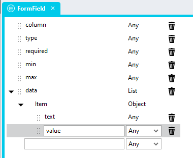
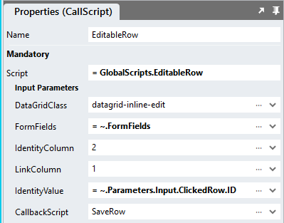

# Datagrid Inline Row Editing

Allowing users to conveniently and swiftly edit selected DataGrid rows

https://github.com/stadium-software/datagrid-inline-row-edit/assets/2085324/cc817c53-c7b6-4f82-88a0-ce9abc5379ad

# Content
- [Datagrid Inline Row Editing](#datagrid-inline-row-editing)
- [Content](#content)
  - [Version](#version)
- [Setup](#setup)
  - [Application Setup](#application-setup)
  - [Database, Connector and DataGrid](#database-connector-and-datagrid)
  - [Type Setup](#type-setup)
  - [Global Script Setup](#global-script-setup)
  - [Page-Script Setup](#page-script-setup)
  - [Page Setup](#page-setup)
  - [Page.Load Event Setup](#pageload-event-setup)
  - [Edit.Click Event Setup](#editclick-event-setup)
  - [Applying the CSS](#applying-the-css)
  - [Customising CSS](#customising-css)
  - [CSS Upgrading](#css-upgrading)

## Version 
Current version 2.1 - changes are required!

2.0 Added checkbox column support; changed header-based column definition to column count instead; added text and value definition for dropdowns. Required changes
1. FormField Type: change "name" property to "column" (see [Type Setup](#type-setup))
2. Script (see [Global Script Setup](#global-script-setup))
   1. Update to version below
   2. Change input parameter name "EditColumnHeader" to "LinkColumn"
   3. Change input parameter name "IdentityColumnHeader" to "IdentityColumn"
3. Event handler (see [Edit.Click Event Script](#editclick-event-setup))
   1. Change FormFields list inputs for "column" (previously "name") from strings to integers
   2. Change FormFields list inputs for "dropdown" from list of strings to list of objects (see [example below](#editclick-event-setup))
   3. Amend values for script input parameters IDColumn & LinkColumn from strings to integers

2.1 Added support for DataGrid searching and sorting; added support for passing column names in the "columns" parameter (optional). Required changes
1. Callback script: The result is no longer passed back to the callback script as an array, but as an object consisting of the columns in the DataGrid. Example:
```json
{
    "ID":"1",
    "FirstName":"Martina",
    "LastName":"Vaughn",
    "NoOfChildren":"10",
    "NoOfPets":"9",
    "StartDate":"2023-10-01",
    "EndDate":"2023-10-02",
    "Healthy":true,
    "Happy":false,
    "Subscription":"1"
}
```

# Setup

## Application Setup
1. Check the *Enable Style Sheet* checkbox in the application properties

## Database, Connector and DataGrid
1. Use the instructions from [this repo](https://github.com/stadium-software/samples-database) to setup the database and DataGrid for this sample
2. The DataGrid must contain an Edit column and the Edit column must have a click event handler

## Type Setup
1. Create a *Type* called "FormField"
2. Add the following properties to the type
   1. "column" (Any)
   2. "type" (Any)
   3. "required" (Any)
   4. "min" (Any)
   5. "max" (Any)
   6. "data" (List)
      1. "Item" (Any)



## Global Script Setup
1. Create a Global Script called "EditableRow"
2. Add five input parameters to the Global Script
   1. DataGridClass
   2. LinkColumn
   3. FormFields
   4. IdentityColumn
   5. IdentityValue
   6. CallbackScript
3. Drag a *JavaScript* action into the script
4. Add the Javascript below into the JavaScript code property
```javascript
/* Stadium Script Version 2.1 https://github.com/stadium-software/datagrid-inline-row-edit */
let scope = this;
let callback = ~.Parameters.Input.CallbackScript;
let pageName = window.location.pathname.replace("/", "");
let dgClassName = "." + ~.Parameters.Input.DataGridClass;
let dg = document.querySelectorAll(dgClassName);
if (dg.length == 0) {
    dg = document.querySelector(".data-grid-container");
} else if (dg.length > 1) {
    console.error("The class '" + dgClassName + "' is assigned to multiple DataGrids. DataGrids using this script must have unique classnames");
    return false;
} else { 
    dg = dg[0];
}
dg.classList.add("stadium-inline-edit-datagrid");
let datagridname = dg.id.replace(`${pageName}_`, "").replace("-container","");
let table = dg.querySelector("table");
let dataGridColumns = getColumnDefinition();
let rowFormFields = ~.Parameters.Input.FormFields;
let IDColumn = ~.Parameters.Input.IdentityColumn;
let IDValue = ~.Parameters.Input.IdentityValue;
let EditLink = ~.Parameters.Input.LinkColumn;
if (isNaN(parseFloat(IDColumn))) {
    IDColumn = getElementIndex(dataGridColumns, IDColumn) + 1;
}
if (isNaN(parseFloat(EditLink))) {
    EditLink = getElementIndex(dataGridColumns, EditLink) + 1;
}
let rowNumber;
let options = {
    childList: true,
    subtree: true,
},
observer = new MutationObserver(resetDataGrid);

insertForm();
initForm();
document.onkeydown = function (evt) {
    evt = evt || window.event;
    let isEscape = false;
    if ("key" in evt) {
        isEscape = (evt.key === "Escape" || evt.key === "Esc");
    } else {
        isEscape = (evt.keyCode === 27);
    }
    if (isEscape) {
        resetDataGrid();
    }
};
observer.observe(dg, options);

/*--------------------------------------------------------------------------------------*/

function initForm() { 
    let IDCells = table.querySelectorAll("tbody tr td:nth-child(" + IDColumn + ")");
    for (let i = 0; i < IDCells.length; i++) {
        let rowtr = IDCells[i].parentElement;
        let IDCell = IDCells[i].innerText.replaceAll(" ", "");
        if (IDCell == IDValue) {
            rowNumber = i+1;
        } else { 
            rowtr.classList.add("opacity");
            rowtr.addEventListener("click", resetDataGrid);
        }
    }
    if (!rowNumber) {
        console.error("The row was not found");
        return false;
    }
    let row = table.querySelector("tbody tr:nth-child(" + rowNumber + ")");
    row.classList.add("edit-orig");
    let cells = row.querySelectorAll("td");
    let editform = document.createElement("tr");
    editform.classList.add("edit-form");
    editform.setAttribute("data-id",IDValue);
    for (let i = 0; i < cells.length; i++) {
        let el, type, data, min, max, required;
        let colNum = i+1;
        let ffield = getElementFromObjects(rowFormFields, colNum, "column");
        let name = dataGridColumns[i];
        if (!ffield) {
            ffield = getElementFromObjects(rowFormFields, name, "column");
        }
        if (ffield) {
            type = ffield.type;
            data = ffield.data;
            min = ffield.min;
            max = ffield.max;
            required = ffield.required;
        }
        let origCell = row.querySelector("td:nth-child(" + colNum + ")");
        let origStyles = origCell.getAttribute("style");
        let cell = document.createElement("td");
        cell.setAttribute("style", origStyles);
        let value = origCell.textContent;
        if (type == "text") {
            el = document.createElement("input");
            el.value = value;
            el.setAttribute("stadium-form-name", name);
            el.classList.add("form-control");
        }
        if (type == "number") {
            el = document.createElement("input");
            el.setAttribute("type", "number");
            if (min) el.setAttribute("min", min);
            if (max) el.setAttribute("max", max);
            el.setAttribute("onkeydown", "return event.keyCode !== 69");
            el.value = value;
            el.setAttribute("stadium-form-name", name);
            el.classList.add("form-control");
        }
        if (type == "date") {
            el = document.createElement("input");
            el.setAttribute("type", "date");
            el.classList.add("form-control");
            if (min) {
                let dmin = new Date(min);
                min = dmin.getFullYear() + '-' + ('0' + (dmin.getMonth() + 1)).slice(-2) + '-' + ('0' + dmin.getDate()).slice(-2);
                el.setAttribute("min", min);
            }
            if (max) {
                let dmax = new Date(max);
                max = dmax.getFullYear() + '-' + ('0' + (dmax.getMonth() + 1)).slice(-2) + '-' + ('0' + dmax.getDate()).slice(-2);
                el.setAttribute("max", max);
            }
            el.setAttribute("stadium-form-name", name);
            let d = new Date(value);
            el.value = d.getFullYear() + '-' + ('0' + (d.getMonth() + 1)).slice(-2) + '-' + ('0' + d.getDate()).slice(-2);
        }
        if (type == "checkbox") {
            el = document.createElement("input");
            el.setAttribute("stadium-form-name", name);
            el.setAttribute("type", "checkbox");
            if (value == "true" || value == "Yes" || value == "1") {
                el.setAttribute("checked", "");
            }
        }
        if (type == "dropdown") {
            el = document.createElement("select");
            for (let j = 0; j < data.length; j++) {
                let option = document.createElement("option");
                if (typeof data[j].text != "undefined" && typeof data[j].value != "undefined") {
                    option.text = data[j].text;
                    option.value = data[j].value;
                } else if (typeof data[j] == "object") {
                    let ob = Object.entries(data[j]);
                    option.text = ob[0][0];
                    option.value = ob[0][1];
                } else {
                    option.text = data[j];
                    option.value = data[j];
                }
                if (option.text == value) {
                    option.selected = true;
                }
                el.appendChild(option);
            }
            el.setAttribute("stadium-form-name", name);
            el.classList.add("form-control");
        }
        if (!type && origCell.querySelector(":not(button, a, [type='checkbox'])")) { 
            cell.textContent = value;
            el = document.createElement("input");
            el.value = value;
            el.setAttribute("stadium-form-name", name);
            el.setAttribute("type", "hidden");
        }
        if (colNum == EditLink) {
            el = document.createElement("button");
            el.classList.add("stadium-form-save");
            el.setAttribute("type", "submit");
            el.innerText = "Save";
        }
        if (el) {
            el.classList.add("stadium-inline-form-control");
            if (required) el.setAttribute("required", "");
            cell.appendChild(el);
        }
        editform.appendChild(cell);
    }
    insertAfter(editform, row);
}
function resetDataGrid(){ 
    observer.disconnect();
    let editorig = table.querySelector(".edit-orig");
    if (editorig) editorig.classList.remove("edit-orig");
    let editform = table.querySelector(".edit-form");
    if (editform) editform.remove();
    let opaque = table.querySelectorAll(".opacity");
    for (let i = 0; i < opaque.length; i++) {
        opaque[i].classList.remove("opacity");
        opaque[i].removeEventListener("click", resetDataGrid);
    }
}
async function saveButtonClick(e) { 
    e.preventDefault();
    let row = table.querySelector(".edit-form");
    let IDVal = row.getAttribute("data-id");
    let cells = row.cells;
    let callbackData = {};
    let objData = {};
    for (let i = 0; i < cells.length; i++) {
        let formField = cells[i].querySelector("[stadium-form-name]:not([stadium-form-name='']");
        if (formField) {
            let fieldValue = formField.value;
            if (formField.getAttribute("type") == "checkbox") fieldValue = formField.checked;
            if (dataGridColumns[i] != "RowSelector") callbackData[dataGridColumns[i]] = fieldValue;
            if (formField.tagName == "SELECT") fieldValue = formField.options[formField.selectedIndex].text;
            objData[dataGridColumns[i]] = fieldValue;
        } else if (IDColumn-1 == i){
            callbackData[dataGridColumns[i]] = IDVal;
            objData[dataGridColumns[i]] = IDVal;
        }
    }
    updateDataModelRow(IDVal, objData);
    await scope[callback](callbackData);
    resetDataGrid();
}
function insertForm() { 
    let exists = false;
    let forms = document.querySelectorAll(".datagrid-inline-edit-form");
    for (let i = 0; i < forms.length; i++) { 
        if (dg.parentNode == forms[i]) { 
            exists = true;
        }
    }
    if (!exists) {
        let form = document.createElement('form');
        form.classList.add("datagrid-inline-edit-form");
        form.addEventListener("submit", saveButtonClick);
        insertAfter(form, dg);
        form.appendChild(dg);
    }
}
function insertAfter(newNode, existingNode) {
    existingNode.parentNode.insertBefore(newNode, existingNode.nextSibling);
}
function getElementIndex(haystack, needle) {
    return haystack.indexOf(needle);
}
function getElementFromObjects(haystack, needle, column) {
    return haystack.find(obj => {return obj[column] == needle;});
}
function updateDataModelRow(id, rowData){
    let handler1 = {};
    let dgData = scope[`${datagridname}Data`];
    let result = dgData.map(el => el[dataGridColumns[IDColumn-1]] == id ? new Proxy(rowData, handler1) : el);
    scope[`${datagridname}Data`] = result;
}
function getColumnDefinition(){
    let cols = [];
    let colDefs = scope[`${datagridname}ColumnDefinitions`];
    if (table.querySelector("thead th:nth-child(1) input[type=checkbox")) cols.push("RowSelector");
    for (let i = 0; i < colDefs.length; i++) {
        cols.push(colDefs[i].name);
    }
    return cols;
}
```

## Page-Script Setup
1. Create a Script inside of the Page with any name you like (e.g. "SaveRow")
2. Add one input parameter to the Script
   1. RowData
3. Drag a *Notification* action into the script
4. In the *Message* property, select the *RowData* parameter from the *Script Input Parameters* category
5. The Notification will display the updated row data as it is passed back to the "SaveRow" script

## Page Setup
1. Drag a *DataGrid* control to the page ([see above](#database-connector-and-datagrid))
2. Add a class of your choosing to the *DataGrid* *Classes* property ti uniquely identify this DataGrid on this page (e.g datagrid-inline-edit)
3. Note: If multiple editable DataGrids are shown on one page, each DataGrid must have a unique classname

## Page.Load Event Setup
1. Populate the DataGrid with data ([see above](#database-connector-and-datagrid))

## Edit.Click Event Setup

NOTE: The DataGrid must contain an Edit column (a clickable row-level column) and that column must have a click event handler (!)

1. Drag a *List* action into the event script and name the List "FormFields"
2. Set the List *Item Type* property to "Types.FormField"
3. Define the editable columns of your datagrid and their form fields
   1. column: The column number (start counting at 1; include all datagrid columns) OR the column property name as it appears in the list of columns and the column "Name" property

   2. type: The type of the column. Supported are
      1. text
      2. date
      3. number
      4. checkbox
      5. dropdown
      6. email
   3. required: A boolean (add "true" if required)
   4. min: A minimum value for number or date columns
   5. max: A maximum value for number or date columns
   6. data: A simple list of values for dropdowns (see example below)
```json
= [{
 "column":3,
 "type": "text"
},{
 "column": "LastName",
 "type": "text"
},{
 "column": 5,
 "type": "number",
 "min": "0",
 "max": "10",
 "required": "true"
},{
 "column": 6,
 "type": "number",
 "min": "0",
 "max": "10",
 "required": "true"
},{
 "column": "StartDate",
 "type": "date",
 "min": "01-01-2010",
 "max": "01-01-2024"
},{
 "column": 8,
 "type": "date",
 "required": "true"
},{
 "column": 9,
 "type": "checkbox"
},{
 "column": 10,
 "type": "checkbox"
},{
 "column": 11,
 "type": "dropdown",
 "data": [{"text":"","value":""}, {"text":"Subscribed","value":"1"}, {"text":"Unsubscribed","value":"2"}, {"text":"No data","value":"3"}],
 "required": "true"
}]
```
4. Drag the Global Script called "EditableRow" into the event script
5. Complete the Input properties for the script
   1. DataGridClass: The unique classname you assigned to the *DataGrid*
   2. LinkColumn: The column number (e.g. 1)  OR the column property name as it appears in the list of columns and the column "Name" property
   3. FormFields: Select the *List* called "FormFields" from the dropdown
   4. IdentityColumn: The column number  (e.g. 2) OR the column property name as it appears in the list of columns and the column "Name" property
   5. IdentityValue: The value from the IdentityColumn that uniquely identifies the row
   6. CallbackScript: The name of the page-level script that will process the updated data (e.g. SaveRow)



## Applying the CSS
The CSS below is required for the correct functioning of the module. Some elements can be [customised](#customising-css) using a variables CSS file. 

**Stadium 6.6 or higher**
1. Create a folder called "CSS" inside of your Embedded Files in your application
2. Drag the two CSS files from this repo [*datagrid-inline-edit-variables.css*](datagrid-inline-edit-variables.css) and [*datagrid-inline-edit.css*](datagrid-inline-edit.css) into that folder
3. Paste the link tags below into the *head* property of your application
```html
<link rel="stylesheet" href="{EmbeddedFiles}/CSS/datagrid-inline-edit.css">
<link rel="stylesheet" href="{EmbeddedFiles}/CSS/datagrid-inline-edit-variables.css">
``` 


**Versions lower than 6.6**
1. Copy the CSS from the two css files into the Stylesheet in your application

## Customising CSS
1. Open the CSS file called [*datagrid-inline-edit-variables.css*](datagrid-inline-edit-variables.css) from this repo
2. Adjust the variables in the *:root* element as you see fit
3. Overwrite the file in the CSS folder of your application with the customised file

## CSS Upgrading
To upgrade the CSS in this module, follow the [steps outlined in this repo](https://github.com/stadium-software/samples-upgrading)
